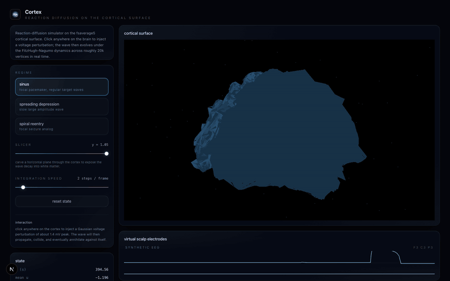

# Cortex

Real-time reaction-diffusion simulator on the fsaverage5 cortical
surface. FitzHugh-Nagumo dynamics integrated on a 20 484 vertex triangle
mesh, in the browser, with a Web Worker driving the integrator.



## Math

The cortex is modeled as a 2-manifold sampled by the fsaverage5 pial
surface (left and right hemispheres merged). On this surface we solve

```
du/dt = D * Laplacian(u) + u - u^3/3 - v + I(x, t)
dv/dt = epsilon * (u + a - b * v)
```

with the cotangent Laplacian of Pinkall and Polthier as the discrete
spatial operator. `I(x, t)` is the stimulation current, set by user
clicks and by a focal pacemaker when running in `sinus` mode.

Three parameter packs reproduce qualitatively distinct cortical regimes:

| mode | dynamics |
|---|---|
| `sinus` | focal pacemaker at a fixed period, regular target waves |
| `sd` | spreading depression. Slow diffusion, large amplitude |
| `spiral` | cross-field initial condition, spiral wave re-entry |

Time integration is forward Euler with a CFL-bounded `dt`. RK2 would be
slightly more stable but the savings are not worth the doubled compute
per step.

## Stack

* Next.js 16, React 19, TypeScript, Tailwind v4.
* Three.js via `@react-three/fiber`, additive bloom via
  `@react-three/postprocessing`.
* A custom GLSL fragment shader maps the voltage at each vertex to the
  cyan-pink colormap.
* A Web Worker holds the simulation state and posts voltage buffers back
  to the main thread on each tick, using `Transferable` for zero-copy.

## Brain mesh

The mesh in `public/brain.bin` is the fsaverage5 pial surface, packed
into a flat little-endian binary buffer (vertex count, triangle count,
positions, indices, hemisphere id). Source: `lh.pial` and `rh.pial`
from the FreeSurfer 5.3 fsaverage5 subject, mirrored in the CBIG
`Schaefer2018_LocalGlobal` distribution (MIT). To regenerate:

```bash
python3 -m venv .venv
. .venv/bin/activate
pip install nibabel numpy
python scripts/convert_brain.py public/brain.bin
```

## Run

```bash
npm install
npm run dev
```

Open `http://localhost:3000` and click anywhere on the cortex to inject
a voltage perturbation.

## References

* H. Edelsbrunner and J. Harer. *Computational Topology: An
  Introduction.* AMS, 2010.
* M. Pinkall and K. Polthier. Computing discrete minimal surfaces and
  their conjugates. *Experimental Mathematics* 2 (1993), 15-36.
* R. FitzHugh. Impulses and physiological states in theoretical models
  of nerve membrane. *Biophysical Journal* 1 (1961), 445-466.
* J. Nagumo, S. Arimoto, S. Yoshizawa. An active pulse transmission
  line simulating nerve axon. *Proceedings of the IRE* 50 (1962),
  2061-2070.
* B. Fischl, M. Sereno, A. Dale. Cortical surface-based analysis II.
  *NeuroImage* 9 (1999), 195-207.
* A. Schaefer et al. Local-global parcellation of the human cerebral
  cortex from intrinsic functional connectivity MRI. *Cerebral Cortex*
  28 (2018), 3095-3114.
